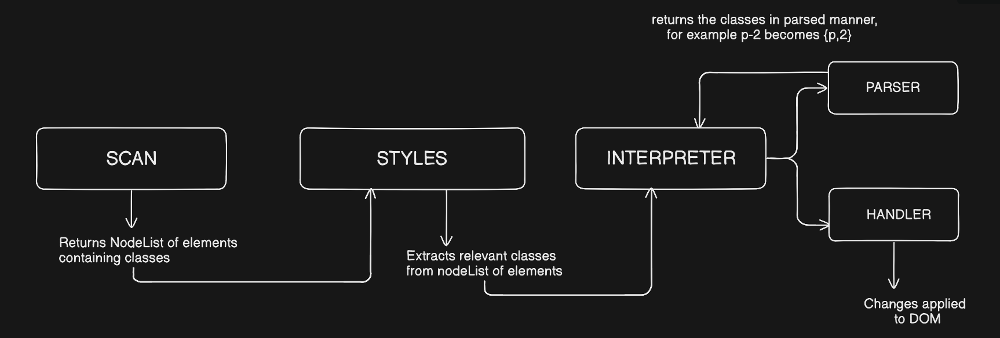
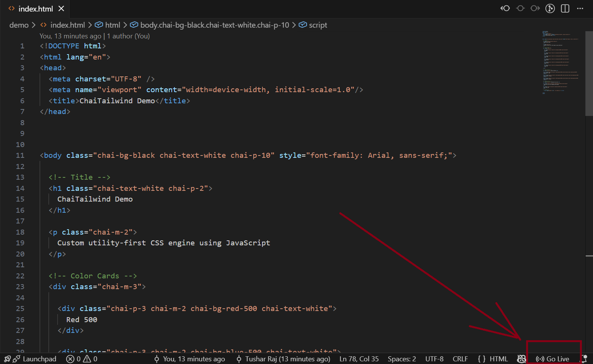

# ChaiTailwind

A lightweight, custom Tailwind-like utility engine built from scratch using JavaScript.

---

## About the Project

ChaiTailwind is a utility-first styling engine that mimics the core idea of Tailwind CSS. Instead of pre-generated CSS, it parses class names and dynamically applies styles to DOM elements at runtime.

This project was built to understand:
- DOM traversal
- Class parsing
- Dynamic styling
- Pipeline architecture

---

## Internal Architecture



Pipeline:

Scanner → Styler → Interpreter → Parser → Handler → DOM Update

---

## Flow Explanation

- **Scanner**
  - Returns a NodeList of elements containing class attributes

- **Styler**
  - Extracts relevant class names from the NodeList

- **Interpreter**
  - Acts as the central controller
  - Sends classes to the parser and handler

- **Parser**
  - Converts class strings into structured data  
  - Example:
    ```
    chai-p-2 → { prefix: "p", value: "2" }
    ```

- **Handler**
  - Applies computed styles to DOM elements

- **DOM Update**
  - Final styles are reflected in the UI

---

## Demo

A demo is included in the project.

### Option 1: Using VS Code Live Server (Recommended)

1. Install the "Live Server" extension in VS Code
   
   
   
2. Open index.html  
3. Click "Go Live" as shown in figure

   

---

### Option 2: Using Node.js

Make sure Node.js is installed, then run:

```bash
git clone <your-repo-url>
cd chai-tailwind
npx http-server
```


## Available Utilities

Below are the currently supported utility classes in ChaiTailwind.

### Background Colors

| Class              | Value   |
| ------------------ | ------- |
| chai-bg-red-100    | #fee2e2 |
| chai-bg-red-300    | #fca5a5 |
| chai-bg-red-500    | #ef4444 |
| chai-bg-red-700    | #b91c1c |
| chai-bg-blue-100   | #dbeafe |
| chai-bg-blue-300   | #93c5fd |
| chai-bg-blue-500   | #3b82f6 |
| chai-bg-blue-700   | #1d4ed8 |
| chai-bg-green-500  | #22c55e |
| chai-bg-yellow-500 | #eab308 |
| chai-bg-purple-500 | #a855f7 |
| chai-bg-pink-500   | #ec4899 |

---

### Text Colors

| Class                | Value   |
| -------------------- | ------- |
| chai-text-black      | black   |
| chai-text-white      | white   |
| chai-text-red-500    | #ef4444 |
| chai-text-blue-500   | #3b82f6 |
| chai-text-green-500  | #22c55e |
| chai-text-yellow-500 | #eab308 |
| chai-text-purple-500 | #a855f7 |
| chai-text-pink-500   | #ec4899 |

---

### Font Sizes

| Class          | Value |
| -------------- | ----- |
| chai-text-xs   | 12px  |
| chai-text-sm   | 14px  |
| chai-text-base | 16px  |
| chai-text-lg   | 18px  |
| chai-text-xl   | 20px  |
| chai-text-2xl  | 24px  |
| chai-text-3xl  | 28px  |
| chai-text-4xl  | 32px  |
| chai-text-5xl  | 40px  |

---

### Padding

| Class     | Value |
| --------- | ----- |
| chai-p-0  | 0px   |
| chai-p-2  | 8px   |
| chai-p-4  | 16px  |
| chai-p-8  | 32px  |
| chai-p-12 | 48px  |
| chai-p-16 | 64px  |

---

### Margin

| Class     | Value |
| --------- | ----- |
| chai-m-0  | 0px   |
| chai-m-2  | 8px   |
| chai-m-4  | 16px  |
| chai-m-8  | 32px  |
| chai-m-12 | 48px  |
| chai-m-16 | 64px  |

---

### Border Radius

| Class             | Value  |
| ----------------- | ------ |
| chai-rounded-none | 0px    |
| chai-rounded-sm   | 4px    |
| chai-rounded      | 8px    |
| chai-rounded-md   | 10px   |
| chai-rounded-lg   | 12px   |
| chai-rounded-xl   | 16px   |
| chai-rounded-full | 9999px |

---

### Shadows

| Class          | Value                       |
| -------------- | --------------------------- |
| chai-shadow-sm | 0 1px 3px rgba(0,0,0,0.1)   |
| chai-shadow    | 0 4px 10px rgba(0,0,0,0.1)  |
| chai-shadow-md | 0 6px 20px rgba(0,0,0,0.15) |
| chai-shadow-lg | 0 10px 30px rgba(0,0,0,0.2) |

---

### Flexbox

| Class                | Description                    |
| -------------------- | ------------------------------ |
| chai-flex            | display: flex                  |
| chai-flex-row        | flex-direction: row            |
| chai-flex-col        | flex-direction: column         |
| chai-justify-start   | justify-content: flex-start    |
| chai-justify-center  | justify-content: center        |
| chai-justify-end     | justify-content: flex-end      |
| chai-justify-between | justify-content: space-between |
| chai-justify-around  | justify-content: space-around  |
| chai-justify-evenly  | justify-content: space-evenly  |
| chai-items-start     | align-items: flex-start        |
| chai-items-center    | align-items: center            |
| chai-items-end       | align-items: flex-end          |
| chai-items-stretch   | align-items: stretch           |
| chai-items-baseline  | align-items: baseline          |

---

### Hover Support

```
hover:chai-bg-red-500
hover:chai-text-blue-300
```


Note: Hover currently works with background color utilities only.

